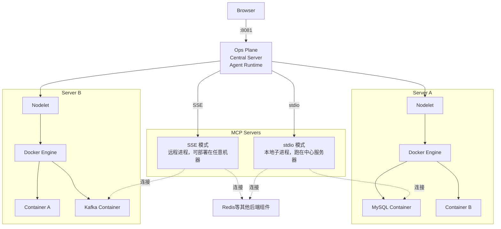
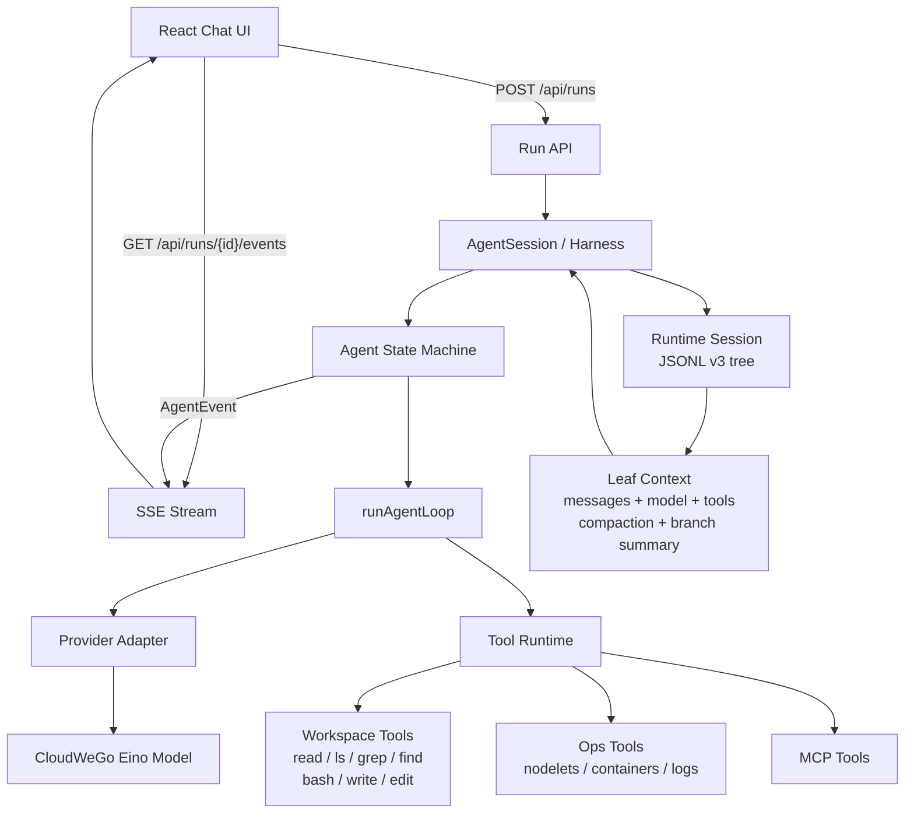

<p align="center">
  <h1>Oops — Ops Plane</h1>
  <em>把多台服务器装进一个面板</em>
</p>

中文 | [English](README_EN.md)

[](https://go.dev/)
[](https://react.dev/)
[](LICENSE)

**Oops** 是一个以项目为单位，面向多服务器环境的 AI 驱动运维面板。一个界面看清所有容器的状态、日志与健康检查结果，内置 Agent，可调用系统工具和 MCP 扩展直接操作容器、执行诊断，随项目增长越用越强。

> Oops!... I Did It Again

---

## 架构



- **Ops Plane** — 中心服务器。提供前端界面，内置 Agent 负责推理与工具调用。用户的问题在这里被转化为对 Nodelet 的查询请求，MCP 连接的启停与保活也由它统一管理。

- **Nodelet** — 部署在每台 Docker 主机上的代理 Agent。对外暴露该主机上所有容器的列表、巡检和日志流，一台主机可以同时跑 MySQL、Redis 等多个容器。容器本身就是沙盒，大模型命令在容器内直接执行。首次运行自动生成配对 Token。

- **MCP Server** — 两类部署模式：**stdio**（本地子进程，跑在中心服务器上）和 **SSE**（远程进程，可部署在任意机器上）。MCP Server 连接到具体容器（MySQL、Redis、ES 等），将容器的运维能力暴露为 LLM 可调用的工具。

### Agent 内部架构



**请求处理流程：**

1. **Run 创建** — React 通过 `POST /api/runs` 创建一次运行，后端恢复或新建 `AgentSession`。
2. **上下文构建** — `AgentSession` 从当前 JSONL leaf 回溯出消息、模型、thinking level、启用工具、compaction summary 和 branch summary。
3. **Agent Loop** — `runAgentLoop` 追加用户消息，请求 Provider，流式接收 assistant message，执行工具，再把 tool result message 按原始 tool call 顺序写回上下文。
4. **Provider 与工具** — Provider 通过 Eino 绑定模型工具 schema；本地执行走 `toolruntime`，覆盖 workspace 工具、运维工具和 MCP 工具。
5. **事件投影** — `AgentEvent` 通过 SSE 推给前端；消息是会话事实来源，事件是运行过程投影。`run_done` 返回完整 session snapshot 覆盖前端增量状态。
6. **持久化** — `message_end` 写入消息，`turn_end` flush pending session writes，`agent_end` 标记 settled。JSONL v3 保留原始 tree、compaction details 和 branch summary details。

**核心组件：**

| 组件 | 源文件 | 职责 |
|---|---|---|
| AI Protocol | [`internal/llm/ai/protocol`](internal/llm/ai/protocol) | Agent message、content、tool definition、AgentEvent 协议 |
| Provider | [`internal/llm/ai/provider`](internal/llm/ai/provider) | Eino 模型创建与流式事件 adapter |
| Agent Core | [`internal/llm/core/agent`](internal/llm/core/agent) | Agent 状态机、队列、abort、`runAgentLoop` |
| Tool Runtime | [`internal/llm/core/toolruntime`](internal/llm/core/toolruntime) | tool registry、schema 校验、顺序/并行执行、hook |
| Runtime Session | [`internal/llm/runtime/session`](internal/llm/runtime/session) | JSONL v3 tree、leaf context、compaction、branch summary |
| Harness | [`internal/llm/runtime/harness`](internal/llm/runtime/harness) | AgentSession、资源加载、消息持久化、settled lifecycle |
| Run API | [`internal/api/run_handlers.go`](internal/api/run_handlers.go) | `/api/runs`、事件订阅、abort |
| Session API | [`internal/api/runtime_session_handlers.go`](internal/api/runtime_session_handlers.go) | runtime session list/detail/delete/branch |
| Workspace Tools | [`internal/llm/runtime/tools`](internal/llm/runtime/tools) | read、ls、grep、find、bash、write、edit |
| Ops Tools | [`internal/llm/tools`](internal/llm/tools) | 运维查询、仓库读取、skill 元工具 |
| MCP Manager | [`internal/mcp/manager.go`](internal/mcp/manager.go) | MCP 连接生命周期、工具动态注册、保活 |
| Skills | [`internal/llm/skills`](internal/llm/skills) + [`config/skills/`](config/skills/) | Skill 定义加载、可用列表渲染 |

---

## 功能

### 容器视图

- 自动识别 MySQL、Redis、PostgreSQL、MongoDB、Nginx、Elasticsearch、Kafka、Etcd 等常见服务。
- 查看容器环境变量、端口映射、健康状态、创建时间和实时日志。
- 从环境变量提取 DSN，并支持手动覆盖和 HTTP 健康检查。

### AI 排查

- 用自然语言查询容器状态、日志和外部连接，例如“Redis 为什么慢？”。
- Agent Runtime 基于 CloudWeGo Eino provider 执行多轮工具调用，支持 abort、分支和完整事件时间线。
- Workspace 工具、运维工具、Skills 和 MCP 工具按任务进入模型可见工具列表，过程通过 SSE 实时展示。

### MCP 与连接

- 支持 stdio 本地子进程和 SSE 远程连接。
- 内置 MySQL、Redis、Elasticsearch、Kafka、Etcd、Nacos MCP Server。
- 支持连接预填、按工具启停、单工具测试和 5 分钟保活。

### 项目与上下文

- 按项目隔离服务器、容器视图和会话。
- 会话使用 DAG 结构和 JSONL 持久化，重启后可恢复。
- 会话支持 compaction entry 与 branch summary，运行时按 leaf context 恢复上下文。

### 执行与安全

- 命令在容器边界内执行，支持超时、输出截断和结构化结果。
- 单用户认证、HttpOnly JWT、Bearer Token、登录限流和 Nodelet API 限流。
- zap + lumberjack 结构化日志，控制台通过 SSE 查看服务端日志和 MCP stderr。

---

## 快速开始

### 环境要求

- Docker
- Docker Compose
- OpenAI 兼容的 API Key（AI 助手；支持 DeepSeek、OpenAI 等任何兼容提供商）

### 1. 克隆

```bash
git clone git@github.com:agermel/oops.git
cd oops
```

### 2. 配置

```bash
# 复制示例配置
cp config/config.example.yaml config/config.yaml
```

编辑 `config/config.yaml`，填写 `llm.api_key`、`llm.base_url` 和 `llm.model`。

首次启动时会交互式创建用户（用户名 + 密码），系统会自动生成密码哈希。

Nodelet 通过 Web UI 的“服务器管理”面板添加。

### 3. 启动 Ops Plane 和本机 Nodelet

使用 Docker Compose 构建并启动中心服务和本机 Nodelet：

```bash
cd deployment
docker compose up -d --build
```

Ops Plane 监听 `:8081`，Nodelet 监听 `:8686`。首次运行会自动生成 Nodelet 认证 Token，默认持久化在 `deployment/nodelet-data/token`。

在浏览器打开 `http://localhost:8081`，登录即可。

### 4. 在其他 Docker 主机启动 Nodelet

在每台远端 Docker 主机上复制 `deployment/docker-compose.nodelet.yml`，将 `OOPS_NODELET_PUBLIC_ADDRESS` 改为该主机可被 Ops Plane 访问的地址，然后启动：

```bash
docker compose -f docker-compose.nodelet.yml up -d
```

### 5. （可选）启用 MCP

在 `deployment/docker-compose.yml` 的 `oops.environment` 中取消 `OOPS_MCP_ALLOWED_COMMANDS` 一行的注释，填入允许执行的 MCP 命令白名单（逗号分隔）。同时取消 `OOPS_LLM_API_KEY` 的注释并填入 API Key。

在 Web UI 的 MCP 管理面板中添加连接即可使用。镜像内置 `mcp-servers/<name>/` 的固定依赖和启动脚本；Compose 仅将 `mcp-servers/local/` 映射到同名容器子目录，供自定义脚本使用。

Kafka 使用 Confluent 官方 MCP Server（`@confluentinc/mcp-confluent`）。默认 Docker 镜像会在构建阶段预装并编译 Kafka MCP 依赖，运行时直接使用 `/opt/oops/mcp-confluent/node_modules/.bin/mcp-confluent`。裸机 Linux 部署时请安装 Node.js 22 LTS 和 npm，或通过 `OOPS_MCP_NODE_BIN` / `OOPS_MCP_NPX_BIN` 指向 Node 22 的二进制。

Kafka MCP 表单中的用户名 / 密码会生成 `KAFKA_API_KEY` / `KAFKA_API_SECRET`。`Security Protocol` 和 `SASL Mechanism` 会写入官方 server 的 `--kafka-config-file`，常见内网 Kafka 可使用 `sasl_plaintext + PLAIN`。示例：

```yaml
bootstrap_servers: kafka.example.com:9094
username: root
password: <secret>
security_protocol: sasl_plaintext
sasl_mechanism: PLAIN
```

### MCP 供应链

架构相关可执行文件不纳入 Git。etcd 和 MySQL 使用固定源码版本构建，三个 Python wrapper 使用 Python 3.12、独立环境和 `uv.lock`：

```bash
./mcp-servers/etcd/build.sh
./mcp-servers/mysql/build.sh
OOPS_MCP_VENV_ROOT="$PWD/.mcp-venvs" ./scripts/sync-mcp-wrapper.sh redis
OOPS_MCP_VENV_ROOT="$PWD/.mcp-venvs" ./mcp-servers/redis/redis-mcp-server --help
```

`mcp-servers/artifacts-manifest.json` 记录来源、版本、平台、SHA-256、许可证、构建和校验命令。`scripts/verify-artifacts.sh` 校验清单结构、wrapper 与 lockfile 的哈希关联、uv 获取脚本的哈希关联，并拒绝 Git 索引中的架构二进制；CI 的锁定同步校验实际下载内容。

---

## 项目结构

```
oops/
├── cmd/
│   ├── oops/                  # Ops Plane 中心服务入口
│   └── oops-nodelet/          # Nodelet Agent 入口
├── internal/
│   ├── api/                   # HTTP REST API：路由、处理器、中间件
│   ├── auth/                  # JWT 认证、bcrypt 哈希、用户存储、限流
│   ├── common/                # 共享工具（环境变量等）
│   ├── config/                # 配置加载（Viper）、项目存储、DSN 存储
│   ├── connection/            # 外部服务健康检查框架 + 注册表
│   ├── console/               # 集中化日志控制台（SSE 推送至浏览器）
│   ├── docker/                # Docker 客户端、22 种服务检测、DSN 提取
│   ├── exec/                  # 沙盒命令执行：超时 + 输出截断 + 结构化结果（Nodelet 侧）
│   ├── llm/                   # AI Protocol、Agent Core、Runtime Session、Provider、工具、Skills
│   ├── logutil/               # 结构化日志（zap + lumberjack 轮转）
│   ├── mcp/                   # MCP 管理器、客户端、工具注册、保活
│   ├── nodelet/               # Nodelet HTTP 服务端、客户端、管理器、探活
│   ├── store/                 # 通用 JSON 文件持久化（原子写入）
│   └── web/                   # 静态文件服务 + SPA 认证包裹
├── web/                       # React SPA（TypeScript, Vite, Lucide 图标）
│   └── src/components/        # UI 组件（30+ 组件）
├── config/                    # 配置文件、Skills、LLM Prompts
├── deployment/                # Nodelet Dockerfile 与 docker-compose
├── mcp-servers/               # MCP Server 源码、固定 wrapper 与供应链清单
│   ├── mysql/                 # MySQL MCP Server
│   ├── redis/                 # Redis MCP Server
│   ├── elasticsearch/         # Elasticsearch MCP Server
│   ├── kafka/                 # Kafka MCP Server
│   ├── etcd/                  # Etcd MCP Server（含 8 个工具）
│   └── nacos/                 # Nacos MCP Server
└── data/                      # 运行时数据：SQLite、YAML 用户、JSONL 会话
```

---


### 添加新 Skill

在 `config/skills/` 下创建 `.md` 文件，Skill 通过 fsnotify 热加载，保存后生效：

```markdown
---
name: my-skill
description: 简短描述这个 Skill 的功能
icon: Zap
label: 我的技能
color: blue
---
你的 Skill 指令内容。LLM 决定加载此 Skill 时，内容会被注入系统提示词。
```

### 添加新 MCP Server

1. 将源码、固定版本的 wrapper 或构建脚本放入 `mcp-servers/<name>/`；Compose 部署的自定义脚本放入 `mcp-servers/local/<name>/`，不要提交架构相关二进制。
2. 在 `mcp-servers/artifacts-manifest.json` 记录来源、版本、平台、SHA-256、许可证、构建和校验命令。
3. 在 Web UI 的 MCP 管理面板中添加连接，配置会写入 `data/runtime.db`；连接支持 `stdio`（本地子进程）和 `sse`（远程）两种传输模式。

## 质量门禁

常用分层检查：

仓库 CI 读取 GitHub Actions variable `OOPS_SENSITIVE_PATTERN`；变量为空、匹配到敏感词或扫描命令异常都会使门禁失败。

```bash
go test -count=1 ./internal/llm/ai/protocol ./internal/llm/core/agent ./internal/llm/core/toolruntime ./internal/llm/runtime/session ./internal/llm/runtime/harness ./internal/api
go test -race -count=1 ./internal/llm/core/agent ./internal/llm/runtime/harness
go test -count=1 ./...
(cd web && npm run build)
(cd web && npm test)
git diff --check -- internal web README.md
rg -n -i "$OOPS_SENSITIVE_PATTERN" --hidden --glob '!.omx/**' --glob '!AGENTS.md' --glob '!.git/**' .
```

边界检查：

| 区域 | 重点 |
|---|---|
| Protocol | JSON snapshot 覆盖 message、content、tool、AgentEvent |
| Agent Core | mock stream 覆盖 tool call、tool error、parallel order、max turns、abort |
| Tool Runtime | schema 校验、hook、顺序/并行、workspace path guard |
| Session | JSONL v3、leaf context、compaction details、branch summary、文件读取 |
| Harness | message persistence、pending writes、settled lifecycle、session resume/fork |
| API | `/api/runs` SSE 顺序、runtime session API、abort |
| Frontend | AgentEvent reducer、Session Tree、工具列表、构建产物 |

## License

MIT — 详见 [LICENSE](LICENSE) 文件。

---

**Oops** — *基础设施，不出意外。*
