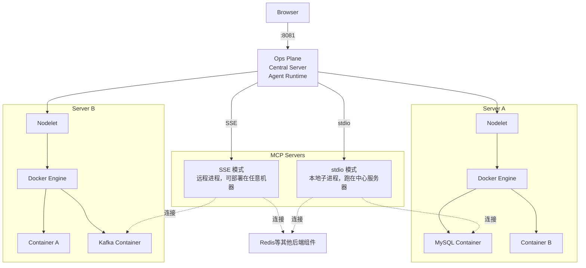
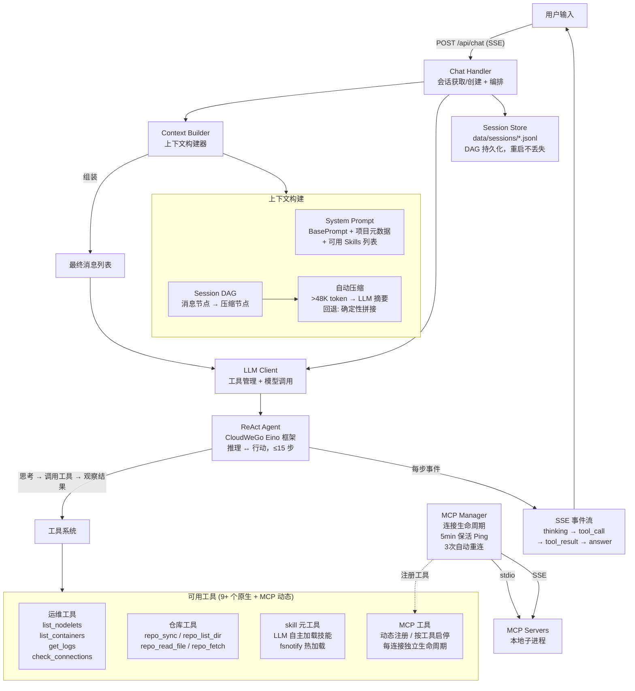

<p align="center">
  <h1>Oops — Ops Plane</h1>
  <em>把多台服务器装进一个面板</em>
</p>

中文 | [English](README_EN.md)

[](https://go.dev/)
[](https://react.dev/)
[](LICENSE)

**Oops** 是一个以项目为单位，面向多服务器环境的 AI 驱动运维面板。一个界面看清所有容器的状态、日志与健康检查结果，内置 Agent，可调用系统工具和 MCP 扩展直接操作容器、执行诊断，随项目增长越用越强。

> Oops!... I Did It Again

---

## 架构



- **Ops Plane** — 中心服务器。提供前端界面，内置 Agent 负责推理与工具调用。用户的问题在这里被转化为对 Nodelet 的查询请求，MCP 连接的启停与保活也由它统一管理。

- **Nodelet** — 部署在每台 Docker 主机上的代理 Agent。对外暴露该主机上所有容器的列表、巡检和日志流，一台主机可以同时跑 MySQL、Redis 等多个容器。容器本身就是沙盒，大模型命令在容器内直接执行。首次运行自动生成配对 Token。

- **MCP Server** — 两类部署模式：**stdio**（本地子进程，跑在中心服务器上）和 **SSE**（远程进程，可部署在任意机器上）。MCP Server 连接到具体容器（MySQL、Redis、ES 等），将容器的运维能力暴露为 LLM 可调用的工具。

### Agent 内部架构



**请求处理流程：**

1. **会话管理** — Chat Handler 根据 `session_id` 获取或创建会话，关联项目上下文（名称、仓库、关联服务器）。
2. **上下文构建** — Context Builder 从 Session DAG 重建历史消息，检查 token 用量。超过 48K 阈值时触发 compaction：调用 LLM 生成对话摘要，将早期消息替换为压缩节点；LLM 不可用时回退到确定性拼接（保留最近 8 条消息）。最终拼接 `System Prompt + 摘要 + 近期消息 + 当前问题`。
3. **ReAct Agent 循环** — 基于 Eino 框架的推理-行动循环。每步由模型决定：直接回答，或调用工具获取更多信息。工具结果注入对话后继续推理，直到模型产生最终答案或达到 15 步上限。
4. **工具执行** — Agent 可调用 9 个原生工具（4 个运维 + 4 个仓库 + 1 个 skill），以及 MCP Manager 动态注册的 MCP 工具。每个工具支持独立启停，禁用后即时从 Agent 可见工具列表中移除。
5. **流式响应** — 每步执行过程（思考、工具调用、工具结果、最终答案）通过 SSE 实时推送至浏览器，用户可观察 Agent 的完整推理链。
6. **持久化** — 每条消息和压缩节点写入 Session DAG，以 JSONL 格式持久化到 `data/sessions/`，重启后完整恢复对话上下文。

**核心组件：**

| 组件 | 源文件 | 职责 |
|---|---|---|
| Chat Handler | [`internal/api/chat_handlers.go`](internal/api/chat_handlers.go) | HTTP 入口，会话编排，SSE 推送 |
| Context Builder | [`internal/llm/context_builder.go`](internal/llm/context_builder.go) | 上下文组装、Token 预算、自动压缩 |
| ReAct Agent | [`internal/llm/agent.go`](internal/llm/agent.go) | Eino ReAct 推理-行动循环，MessageFuture 流式迭代 |
| LLM Client | [`internal/llm/client.go`](internal/llm/client.go) | 模型封装、工具注册、运行时启停 |
| 原生工具 | [`internal/llm/tools.go`](internal/llm/tools.go) + [`internal/llm/tools_repo.go`](internal/llm/tools_repo.go) | 运维查询（4）+ 仓库操作（4）+ skill 元工具 |
| MCP Manager | [`internal/mcp/manager.go`](internal/mcp/manager.go) | MCP 连接生命周期、工具动态注册、保活 |
| Session Store | [`internal/llm/session.go`](internal/llm/session.go) + [`internal/llm/session_persist.go`](internal/llm/session_persist.go) | DAG 结构、JSONL 持久化、压缩节点管理 |
| Skills | [`internal/llm/skill.go`](internal/llm/skill.go) + [`config/skills/`](config/skills/) | Skill 定义加载、fsnotify 热更新、可用列表渲染 |

---

## 功能

### 容器视图

- 自动识别 MySQL、Redis、PostgreSQL、MongoDB、Nginx、Elasticsearch、Kafka、Etcd 等常见服务。
- 查看容器环境变量、端口映射、健康状态、创建时间和实时日志。
- 从环境变量提取 DSN，并支持手动覆盖和 HTTP 健康检查。

### AI 排查

- 用自然语言查询容器状态、日志和外部连接，例如“Redis 为什么慢？”。
- ReAct Agent 基于 CloudWeGo Eino 执行最多 15 步工具调用。
- Skills、原生工具和 MCP 工具按任务动态加载，过程通过 SSE 实时展示。

### MCP 与连接

- 支持 stdio 本地子进程和 SSE 远程连接。
- 内置 MySQL、Redis、Elasticsearch、Kafka、Etcd、Nacos MCP Server。
- 支持连接预填、按工具启停、单工具测试和 5 分钟保活。

### 项目与上下文

- 按项目隔离服务器、容器视图和会话。
- 会话使用 DAG 结构和 JSONL 持久化，重启后可恢复。
- 超过 48K token 自动压缩早期上下文。

### 执行与安全

- 命令在容器边界内执行，支持超时、输出截断和结构化结果。
- 单用户认证、HttpOnly JWT、Bearer Token、登录限流和 Nodelet API 限流。
- zap + lumberjack 结构化日志，控制台通过 SSE 查看服务端日志和 MCP stderr。

---

## 快速开始

### 环境要求

- Docker
- Docker Compose
- OpenAI 兼容的 API Key（AI 助手；支持 DeepSeek、OpenAI 等任何兼容提供商）

### 1. 克隆

```bash
git clone git@github.com:agermel/oops.git
cd oops
```

### 2. 配置

```bash
# 复制示例配置
cp config/config.example.yaml config/config.yaml
```

编辑 `config/config.yaml`，填写 `llm.api_key`、`llm.base_url` 和 `llm.model`。

首次启动时会交互式创建用户（用户名 + 密码），系统会自动生成密码哈希。

Nodelet 通过 Web UI 的“服务器管理”面板添加。

### 3. 启动 Ops Plane 和本机 Nodelet

使用 Docker Compose 构建并启动中心服务和本机 Nodelet：

```bash
cd deployment
docker compose up -d --build
```

Ops Plane 监听 `:8081`，Nodelet 监听 `:8686`。首次运行会自动生成 Nodelet 认证 Token，默认持久化在 `deployment/nodelet-data/token`。

在浏览器打开 `http://localhost:8081`，登录即可。

### 4. 在其他 Docker 主机启动 Nodelet

在每台远端 Docker 主机上复制 `deployment/docker-compose.nodelet.yml`，将 `OOPS_NODELET_PUBLIC_ADDRESS` 改为该主机可被 Ops Plane 访问的地址，然后启动：

```bash
docker compose -f docker-compose.nodelet.yml up -d
```

### 5. （可选）启用 MCP

在 `deployment/docker-compose.yml` 的 `oops.environment` 中取消 `OOPS_MCP_ALLOWED_COMMANDS` 一行的注释，填入允许执行的 MCP 命令白名单（逗号分隔）。同时取消 `OOPS_LLM_API_KEY` 的注释并填入 API Key。

在 Web UI 的 MCP 管理面板中添加连接即可使用。MCP Server 二进制文件放在 `mcp-servers/<name>/` 目录下，该目录会以只读方式挂载到 Ops Plane 容器内。

---

## 项目结构

```
oops/
├── cmd/
│   ├── oops/                  # Ops Plane 中心服务入口
│   └── oops-nodelet/          # Nodelet Agent 入口
├── internal/
│   ├── api/                   # HTTP REST API：路由、处理器、中间件
│   ├── auth/                  # JWT 认证、bcrypt 哈希、用户存储、限流
│   ├── common/                # 共享工具（环境变量等）
│   ├── config/                # 配置加载（Viper）、项目存储、DSN 存储
│   ├── connection/            # 外部服务健康检查框架 + 注册表
│   ├── console/               # 集中化日志控制台（SSE 推送至浏览器）
│   ├── docker/                # Docker 客户端、22 种服务检测、DSN 提取
│   ├── exec/                  # 沙盒命令执行：超时 + 输出截断 + 结构化结果（Nodelet 侧）
│   ├── llm/                   # LLM Agent（ReAct via Eino）、工具、Skills、会话、上下文构建、重试
│   ├── logutil/               # 结构化日志（zap + lumberjack 轮转）
│   ├── mcp/                   # MCP 管理器、客户端、工具注册、保活
│   ├── nodelet/               # Nodelet HTTP 服务端、客户端、管理器、探活
│   ├── store/                 # 通用 JSON 文件持久化（原子写入）
│   └── web/                   # 静态文件服务 + SPA 认证包裹
├── web/                       # React SPA（TypeScript, Vite, Lucide 图标）
│   └── src/components/        # UI 组件（30+ 组件）
├── config/                    # 配置文件、Skills、LLM Prompts
├── deployment/                # Nodelet Dockerfile 与 docker-compose
├── mcp-servers/               # 预构建 MCP Server 二进制文件与源码
│   ├── mysql/                 # MySQL MCP Server
│   ├── redis/                 # Redis MCP Server
│   ├── elasticsearch/         # Elasticsearch MCP Server
│   ├── kafka/                 # Kafka MCP Server
│   ├── etcd/                  # Etcd MCP Server（含 8 个工具）
│   └── nacos/                 # Nacos MCP Server
└── data/                      # 运行时数据：SQLite、YAML 用户、JSONL 会话
```

---


### 添加新 Skill

在 `config/skills/` 下创建 `.md` 文件，Skill 通过 fsnotify 热加载，保存后生效：

```markdown
---
name: my-skill
description: 简短描述这个 Skill 的功能
icon: Zap
label: 我的技能
color: blue
---
你的 Skill 指令内容。LLM 决定加载此 Skill 时，内容会被注入系统提示词。
```

### 添加新 MCP Server

1. 将 MCP Server 二进制放入 `mcp-servers/<name>/`
2. 在 Web UI 的 MCP 管理面板中添加连接，或编辑 `config/mcp_connections.json`
3. MCP 连接支持 `stdio`（本地子进程）和 `sse`（远程）两种传输模式


## License

MIT — 详见 [LICENSE](LICENSE) 文件。

---

**Oops** — *基础设施，不出意外。*
