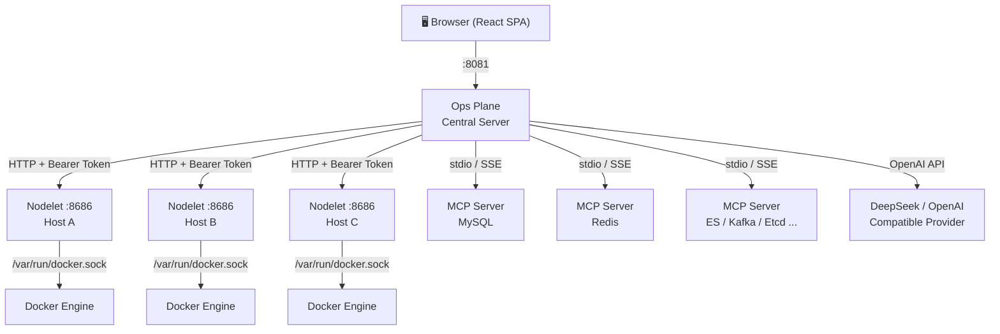

# Oops — Ops Plane

**AI 驱动的运维管理平台，一面玻璃，全局掌控。**
*AI-powered infrastructure operations platform. One pane of glass, global control.*

[](https://go.dev/)
[](https://react.dev/)
[](LICENSE)

---

## 架构 / Architecture



- **Ops Plane** — 中心服务器，承载 React 前端、REST API、LLM Agent。代理 Nodelet 请求，管理 MCP 连接生命周期，执行 ReAct Agent 推理循环。
  *Central server: hosts the React SPA, REST API, and LLM Agent. Proxies nodelet requests, manages MCP connection lifecycles, and runs the ReAct agent loop.*

- **Nodelet** — 部署在每台 Docker 主机上的轻量 Agent，通过 HTTP 暴露容器列表、巡检、日志流接口。首次运行自动生成配对 Token。
  *Lightweight per-host agent exposing container lists, inspection, and log streaming via HTTP. Auto-generates a pairing token on first run.*

- **MCP Server** — 社区 MCP Server，通过 stdio（本地子进程）或 SSE（远程）接入，扩展 AI 助手的工具集。
  *Community MCP servers connected via stdio (local subprocess) or SSE (remote), extending the AI assistant's tool set.*

---

## 功能 / Features

### 🐳 Docker 与容器管理 / Docker & Container Management

- **自动识别 22 种服务** — 从容器镜像检测 MySQL、Redis、PostgreSQL、MongoDB、Nginx、Elasticsearch、Kafka、Etcd、Jaeger、Nacos、RabbitMQ、ClickHouse、MinIO、Consul、ZooKeeper、Prometheus、Grafana、InfluxDB、Memcached、Cassandra、Neo4j、Caddy
  *Auto-detect 22 service types from container image names.*
- **容器巡检** — 环境变量、端口映射、健康检查、创建时间
  *Container inspection: environment variables, port mappings, health status, creation time.*
- **实时日志流** — SSE 推送容器日志，支持 ANSI 颜色渲染
  *Real-time log streaming via SSE with ANSI color rendering.*
- **DSN 自动检测** — 从容器环境变量提取连接字符串，支持手动覆盖
  *Auto-detect Data Source Names from container environment variables, with manual override support.*
- **按需健康检查** — HTTP 端点探测，即时反馈
  *On-demand HTTP health checks for container endpoints.*

### 🤖 AI 运维助手 / AI Operations Assistant

- **自然语言排查** — "Redis 为什么慢？""MySQL 容器有什么报错？"
  *Natural language troubleshooting: "Why is Redis slow?" / "What errors are in the MySQL container?"*
- **ReAct Agent** — 基于 CloudWeGo Eino 框架的 推理-行动 循环，最多 15 步
  *ReAct (Reasoning + Acting) agent via CloudWeGo Eino framework, up to 15 steps.*
- **Skills 技能系统** — Agent 自主决定何时加载技能（诊断、巡检、自定义），无需预路由
  *Skills system: the LLM autonomously decides when to load a skill (diagnose, inspect, custom) — no pre-routing needed.*
- **流式响应** — 实时展示 Agent 思考、工具调用与结果
  *Streaming responses: see agent reasoning steps, tool calls, and results in real time.*
- **4 个原生工具** — `list_nodelets`、`list_containers`、`get_logs`、`check_connections`
  *4 native tools available to the LLM.*

### 🧠 Context Engineering (v2) / 上下文工程

- **DAG 会话结构** — 消息与压缩节点构成有向无环图，支持分支
  *DAG-based session entries (message + compaction nodes) with branching support.*
- **自动压缩** — 超过 48K token 阈值时，早期消息自动摘要
  *Automatic compaction: when context exceeds ~48K tokens, earlier messages are summarized.*
- **JSONL 持久化** — 会话存于 `data/sessions/`，重启不丢失
  *JSONL persistence at `data/sessions/` — sessions survive server restarts.*
- **Token 预算** — 64K 输入 + 8K 输出，工具结果截断 2000 字符
  *64K input + 8K output token budget with 2000-char tool result truncation.*

### 🔌 MCP 集成 / MCP (Model Context Protocol) Integration

- **双传输模式** — stdio（本地子进程）+ SSE（远程连接）
  *Dual transport: stdio (local subprocess) and SSE (remote).*
- **内置 MCP Server** — MySQL、Redis、Elasticsearch、Kafka、Etcd、Nacos
  *Pre-built MCP server binaries for MySQL, Redis, Elasticsearch, Kafka, Etcd, Nacos.*
- **连接智能预填** — 自动检测服务器 IP、容器端口、类型默认值
  *Smart pre-fill: auto-detects server IP, container port, and type defaults for connection forms.*
- **按工具启停** — 界面内单独开关每个工具
  *Per-tool enable/disable in the web UI.*
- **工具连通性测试** — 直接测试单个 MCP 工具
  *In-UI tool connectivity testing.*
- **自动保活** — 每 5 分钟 Ping，异常退出自动重启
  *Auto-keepalive every 5 minutes with automatic restart on failure.*

### 📁 项目管理 / Project-Based Multi-Tenancy

- 创建项目，将服务器（Nodelet）分配到项目
  *Create projects and assign nodelets to projects.*
- 项目级会话隔离和容器视图
  *Project-scoped chat sessions and container views.*
- 全局和项目两种导航模式
  *Global and per-project navigation modes.*

### 🏥 连接监控 / Connection Monitoring

- 配置外部服务连接（Elasticsearch、Jaeger、Nacos、HTTP、TCP）
  *Configure external service connections: Elasticsearch, Jaeger, Nacos, HTTP, TCP.*
- 并行健康检查，独立超时
  *Parallel health checks with independent per-connection timeouts.*
- 仪表盘实时状态（存活 / 死亡 / 未知）
  *Dashboard real-time status indicators: alive / dead / unknown.*

### 🔐 认证与安全 / Authentication & Security

- YAML 用户存储 + bcrypt 密码哈希
  *YAML-based user store with bcrypt password hashing.*
- JWT 会话令牌（HttpOnly Cookie）
  *JWT session tokens via HttpOnly cookies.*
- 登录频率限制，防暴力破解
  *Login rate limiting to prevent brute force.*
- Nodelet 到 Server 的 Bearer Token 认证（首次运行自动生成）
  *Nodelet-to-server Bearer Token auth, auto-generated on first run.*
- Nodelet API 限流（50 req/s）
  *Per-nodelet API rate limiting: 50 req/s.*

### 📊 可观测性 / Observability

- **控制台中心** — SSE 推送服务端日志至浏览器
  *Centralized console log viewer with SSE push to browser.*
- **结构化日志** — zap + lumberjack 日志轮转
  *Structured logging via zap with lumberjack log rotation.*
- **MCP stderr 捕获** — 子进程标准错误可视化
  *MCP subprocess stderr capture and display.*
- **全链路日志** — 鉴权失败、限流触发、CRUD 操作均可观测
  *Full-chain observability: auth failures, rate-limit triggers, CRUD operations.*

---

## 快速开始 / Quick Start

### 环境要求 / Prerequisites

- Go 1.25+
- Node.js 20+（构建前端 / for building the frontend）
- Docker（容器管理 / for container management）
- OpenAI 兼容的 API Key（AI 助手 / for the AI assistant；支持 DeepSeek、OpenAI 等任何兼容提供商）

### 1. 克隆 & 构建 / Clone & Build

```bash
git clone git@github.com:agermel/oops.git
cd oops

# 构建前端 / Build frontend
cd web && npm install && npm run build && cd ..

# 构建 Ops Plane 服务端 / Build central server
go build -o oops ./cmd/oops

# 构建 Nodelet（或直接使用 Docker 镜像） / Build nodelet (or use Docker image)
go build -o oops-nodelet ./cmd/oops-nodelet
```

### 2. 配置 / Configure

```bash
# 复制示例配置 / Copy example config
cp config/config.example.yaml config/config.yaml

# 设置用户凭据 / Set up user credentials
cp data/users.yml.example data/users.yml

# 生成密码哈希 / Generate password hash
./oops hash-password
```

编辑 `config/nodelets.json` 添加你的 Nodelet：

```json
{
  "nodelets": [
    {
      "id": "local",
      "name": "本地 Docker",
      "address": "http://127.0.0.1:8686",
      "token": "<nodelet 启动时自动生成的 token>"
    }
  ]
}
```

### 3. 启动 Nodelet / Start Nodelet

在每台 Docker 主机上 / On each Docker host：

```bash
# 直接运行 / Direct run
./oops-nodelet

# 或通过 Docker Compose / Or via Docker Compose
cd deployment && docker compose -f docker-compose.nodelet.yml up -d
```

Nodelet 监听 `:8686`，首次运行自动生成认证 Token（默认存储于 `/var/lib/oops/nodelet/token`）。
*The nodelet listens on `:8686` and auto-generates a pairing token on first run (stored at `/var/lib/oops/nodelet/token` by default).*

### 4. 启动 Ops Plane / Start Ops Plane

```bash
OOPS_LLM_API_KEY="sk-..." ./oops
```

浏览器打开 `http://localhost:8081`，登录即可。
*Open `http://localhost:8081` in a browser and log in.*

### 5. （可选）启用 MCP / (Optional) Enable MCP

```bash
# 设置允许的 MCP 命令白名单 / Set allowed MCP commands
export OOPS_MCP_ALLOWED_COMMANDS="mysql-mcp-server,redis-mcp-server"
```

构建 MCP Server 二进制文件 / Build MCP server binaries：

```bash
cd mcp-servers/mysql && go build -o mysql-mcp-server . && cd ../..
cd mcp-servers/redis && go build -o redis-mcp-server . && cd ../..
cd mcp-servers/etcd   && go build -o etcd-mcp-server .   && cd ../..
```

在 Web UI 的 MCP 管理面板中添加连接即可使用。
*Add connections in the MCP management panel in the web UI.*

---

## 配置参考 / Configuration Reference

### 环境变量 / Environment Variables

| 变量 / Variable | 默认值 / Default | 说明 / Description |
|---|---|---|
| `OOPS_ADDR` | `:8081` | Ops Plane 监听地址 / Central server listen address |
| `OOPS_CONFIG` | `config/config.yaml` | 配置文件路径 / Config file path |
| `OOPS_LLM_API_KEY` | — | LLM API Key（支持 `${OOPS_LLM_API_KEY}` 语法） |
| `OOPS_BEHIND_PROXY` | `false` | 反向代理后启用 HSTS / Enable HSTS behind reverse proxy |
| `OOPS_CORS_ORIGIN` | — | CORS 允许来源 / CORS allowed origin |
| `OOPS_MCP_ALLOWED_COMMANDS` | — | MCP 命令白名单（逗号分隔）/ Comma-separated MCP command whitelist |
| `OOPS_NODELET_ADDR` | `:8686` | Nodelet 监听地址 / Nodelet listen address |
| `OOPS_NODELET_PUBLIC_ADDRESS` | `http://localhost:8686` | Nodelet 公开地址 / Nodelet public address |
| `OOPS_NODELET_LOG_PATH` | `/var/log/oops/nodelet.log` | Nodelet 日志路径 / Nodelet log file path |
| `OOPS_NODELET_TOKEN_FILE` | `/var/lib/oops/nodelet/token` | Nodelet Token 持久化路径 / Token persistence path |

### 配置文件 / Configuration Files

| 文件 / File | 用途 / Purpose |
|---|---|
| `config/config.yaml` | 主配置：LLM、MCP 默认值、外部连接、数据源 DSN / Main config |
| `config/nodelets.json` | Nodelet 注册表 / Nodelet registry |
| `config/mcp_connections.json` | MCP 连接定义（Web UI 管理） / MCP connection definitions |
| `config/projects.json` | 项目定义（Web UI 管理） / Project definitions |
| `config/container_dsn.json` | 容器 DSN 手动覆盖（Web UI 管理） / Container DSN overrides |
| `config/skills/*.md` | Skill 定义（Markdown + YAML 头信息） / Skill definitions |
| `data/users.yml` | 用户凭据（bcrypt 哈希） / User credentials |
| `data/events.db` | SQLite 事件存储（LLM 对话事件） / SQLite event store |
| `data/sessions/` | JSONL 会话文件 / JSONL session files |

### config.yaml 键值参考 / Config Keys Reference

| 键 / Key | 说明 / Description |
|---|---|
| `env` | 运行环境：`"prod"` 或 `"dev"` / Runtime environment |
| `connections` | 外部服务健康检查目标列表 / External health check targets |
| `mysql` / `redis` / `etcd` / `kafka` | 数据源 DSN 配置 / Data source DSNs |
| `otel` | OpenTelemetry 端点 / OpenTelemetry endpoint |
| `llm` | LLM 配置（`enabled`、`model`、`base_url`、`api_key`） |
| `mcp` | MCP 默认配置（`enabled`、`transport`、`command` / `url`） |

完整示例见 `config/config.example.yaml`。 / *See `config/config.example.yaml` for a complete example.*

---

## API 概览 / API Overview

所有需要认证的路由均经过 `securityHeaders → rateLimit → authMiddleware → requireAuth → limitBody → handler` 中间件链。
*All authenticated routes pass through the middleware chain above.*

### Auth

| Method | Path | 说明 / Description |
|---|---|---|
| `POST` | `/api/token` | 登录，获取 JWT / Create session token (login) |
| `DELETE` | `/api/token` | 登出，销毁 JWT / Revoke session token (logout) |
| `GET` | `/api/auth/me` | 获取当前用户信息 / Get current user info |

### Nodelets

| Method | Path | 说明 / Description |
|---|---|---|
| `GET` | `/api/nodelets` | 列出所有 Nodelet 配置 / List nodelet configs |
| `GET` | `/api/nodelets/status` | 获取状态（含健康探活结果） / Get statuses with health info |
| `POST` | `/api/nodelets` | 添加 Nodelet / Add a nodelet |
| `PUT` | `/api/nodelets/{id}` | 更新 Nodelet / Update a nodelet |
| `DELETE` | `/api/nodelets/{id}` | 删除 Nodelet / Remove a nodelet |
| `POST` | `/api/nodelets/test` | 测试 Nodelet 连通性 / Test connectivity |
| `POST` | `/api/nodelets/{id}/probe` | 强制探活单个 Nodelet / Force-probe one nodelet |
| `POST` | `/api/nodelets/probe-all` | 强制探活所有 Nodelet / Force-probe all nodelets |
| `GET` | `/api/nodelets/{nodeletID}/containers` | 列出容器 / List containers |
| `GET` | `/api/nodelets/{nodeletID}/containers/{containerID}/logs` | 获取历史日志 / Get container logs |
| `GET` | `/api/nodelets/{nodeletID}/containers/{containerID}/logs/stream` | SSE 实时日志流 / Stream container logs (SSE) |

### Chat & Sessions

| Method | Path | 说明 / Description |
|---|---|---|
| `POST` | `/api/chat` | 发送聊天消息（全局） / Send chat message (global scope) |
| `GET` | `/api/sessions` | 列出会话 / List sessions |
| `GET` | `/api/sessions/{id}` | 获取会话详情 / Get session detail |
| `DELETE` | `/api/sessions/{id}` | 删除会话 / Delete a session |

### MCP Connections

| Method | Path | 说明 / Description |
|---|---|---|
| `GET` | `/api/mcp/connections` | 列出 MCP 连接（含运行时状态） / List MCP connections |
| `POST` | `/api/mcp/connections` | 添加 MCP 连接 / Add MCP connection |
| `PUT` | `/api/mcp/connections/{id}` | 更新 MCP 连接 / Update MCP connection |
| `DELETE` | `/api/mcp/connections/{id}` | 删除 MCP 连接 / Remove MCP connection |
| `POST` | `/api/mcp/connections/{id}/test` | 测试 MCP 连接 / Test MCP connection |
| `POST` | `/api/mcp/connections/{id}/tools/{toolName}/test` | 测试单个 MCP 工具 / Test a specific MCP tool |

### Tools & Skills

| Method | Path | 说明 / Description |
|---|---|---|
| `GET` | `/api/tools` | 列出所有工具（原生 + MCP） / List all tools |
| `PUT` | `/api/tools/{name}` | 切换工具启用状态 / Toggle tool enabled state |
| `GET` | `/api/skills` | 列出所有 Skill / List skills |
| `PUT` | `/api/skills/{name}` | 更新 Skill / Update a skill |
| `DELETE` | `/api/skills/{name}` | 删除 Skill / Delete a skill |

### Projects

| Method | Path | 说明 / Description |
|---|---|---|
| `GET` | `/api/projects` | 列出项目 / List projects |
| `POST` | `/api/projects` | 创建项目 / Create project |
| `GET` | `/api/projects/{pid}` | 获取项目详情 / Get project detail |
| `PUT` | `/api/projects/{pid}` | 更新项目 / Update project |
| `DELETE` | `/api/projects/{pid}` | 删除项目 / Delete project |
| `POST` | `/api/projects/{pid}/chat` | 项目级聊天 / Project-scoped chat |
| `GET` | `/api/projects/{pid}/sessions` | 项目会话列表 / List project sessions |
| `GET` | `/api/projects/{pid}/sessions/{id}` | 项目会话详情 / Get project session |
| `DELETE` | `/api/projects/{pid}/sessions/{id}` | 删除项目会话 / Delete project session |
| `GET` | `/api/projects/{pid}/servers` | 项目服务器列表 / List project servers |
| `POST` | `/api/projects/{pid}/servers` | 分配服务器到项目 / Assign server to project |
| `DELETE` | `/api/projects/{pid}/servers/{sid}` | 移除项目服务器 / Remove server from project |
| `GET` | `/api/projects/{pid}/servers/{sid}/containers` | 项目容器列表 / List project containers |
| `GET` | `/api/projects/{pid}/servers/{sid}/containers/{cid}` | 容器详情 / Container detail |
| `GET` | `/api/projects/{pid}/servers/{sid}/containers/{cid}/logs/stream` | SSE 容器日志 / Container log stream |
| `POST` | `/api/projects/{pid}/servers/{sid}/containers/{cid}/check` | 健康检查 / Health check |
| `GET` | `/api/projects/{pid}/servers/{sid}/containers/{cid}/mcp` | 容器 MCP 信息 / Container MCP info |
| `DELETE` | `/api/projects/{pid}/servers/{sid}/containers/{cid}/mcp` | 删除容器 MCP 绑定 / Delete MCP binding |
| `GET` | `/api/projects/{pid}/servers/{sid}/containers/{cid}/dsn` | 容器 DSN 信息 / Container DSN info |
| `PUT` | `/api/projects/{pid}/servers/{sid}/containers/{cid}/dsn` | 设置 DSN 覆盖 / Set DSN override |
| `DELETE` | `/api/projects/{pid}/servers/{sid}/containers/{cid}/dsn` | 删除 DSN 覆盖 / Delete DSN override |

### Other

| Method | Path | 说明 / Description |
|---|---|---|
| `GET` | `/api/connections/status` | 外部连接健康检查结果 / Connection health status |
| `GET` | `/api/console/stream` | 控制台 SSE 日志流 / Console log SSE stream |

---

## 项目结构 / Project Structure

```
oops/
├── cmd/
│   ├── oops/                  # Ops Plane 中心服务入口 / Central server entry point
│   └── oops-nodelet/          # Nodelet Agent 入口 / Nodelet agent entry point
├── internal/
│   ├── api/                   # HTTP REST API：路由、处理器、中间件 / Routes, handlers, middleware
│   ├── auth/                  # JWT 认证、bcrypt 哈希、用户存储、限流 / JWT auth, user store, rate limiting
│   ├── common/                # 共享工具（环境变量等） / Shared utilities
│   ├── config/                # 配置加载（Viper）、项目存储、DSN 存储 / Config, project store, DSN store
│   ├── connection/            # 外部服务健康检查框架 + 注册表 / Health check framework + registry
│   ├── console/               # 集中化日志控制台（SSE 推送至浏览器） / Centralized log console hub
│   ├── docker/                # Docker 客户端、22 种服务检测、DSN 提取 / Docker client, service detector, DSN extraction
│   ├── llm/                   # LLM Agent（ReAct via Eino）、工具、Skills、会话、上下文构建、重试
│   ├── logutil/               # 结构化日志（zap + lumberjack 轮转） / Structured logging
│   ├── mcp/                   # MCP 管理器、客户端、工具注册、保活 / MCP manager, client, keepalive
│   ├── nodelet/               # Nodelet HTTP 服务端、客户端、管理器、探活 / Nodelet server, client, manager, prober
│   ├── store/                 # 通用 JSON 文件持久化（原子写入） / Generic JSON file persistence
│   └── web/                   # 静态文件服务 + SPA 认证包裹 / Static file serving with auth wrapping
├── web/                       # React SPA（TypeScript, Vite, Lucide 图标）
│   └── src/components/        # UI 组件（30+ 组件） / UI components
├── config/                    # 配置文件、Skills、LLM Prompts / Config files, skills, prompts
├── deployment/                # Nodelet Dockerfile 与 docker-compose / Nodelet deployment files
├── mcp-servers/               # 预构建 MCP Server 二进制文件与源码 / Pre-built MCP server binaries & source
│   ├── mysql/                 # MySQL MCP Server
│   ├── redis/                 # Redis MCP Server
│   ├── elasticsearch/         # Elasticsearch MCP Server
│   ├── kafka/                 # Kafka MCP Server
│   ├── etcd/                  # Etcd MCP Server（含 8 个工具 / 8 tools）
│   └── nacos/                 # Nacos MCP Server
└── data/                      # 运行时数据：SQLite、YAML 用户、JSONL 会话 / Runtime data
```

---

## 开发指南 / Development Guide

### 后端开发 / Backend

```bash
# 开发模式运行中心服务 / Run central server in dev mode
go run ./cmd/oops

# 开发模式运行本地 Nodelet / Run local nodelet for development
go run ./cmd/oops-nodelet

# 运行全部测试 / Run all tests
go test ./...

# 运行特定包测试 / Run specific package tests
go test ./internal/llm/...
```

核心依赖：CloudWeGo Eino（LLM Agent 框架）、Moby（Docker 客户端）、mcp-go（MCP 协议）、zap（日志）、Viper（配置）、modernc.org/sqlite（纯 Go SQLite）。

### 前端开发 / Frontend

```bash
cd web
npm install
npm run dev       # 开发服务器 + HMR，端口 5173 / Dev server with HMR on :5173
npm run build     # 生产构建至 web/dist/ / Production build to web/dist/
```

核心依赖：React 19、TypeScript、Vite 8、Lucide React（图标）、ansi-to-html（日志渲染）、streamdown（Markdown 流式渲染）、@microsoft/fetch-event-source（SSE 客户端）。

### 添加新 Skill / Adding a New Skill

在 `config/skills/` 下创建 `.md` 文件，Skill 通过 fsnotify 热加载，无需重启：

```markdown
---
name: my-skill
description: 简短描述这个 Skill 的功能 / Short description of what this skill does
icon: Zap
label: 我的技能
color: blue
---
你的 Skill 指令内容。LLM 决定加载此 Skill 时，内容会被注入系统提示词。
Your skill instructions. This content is injected into the system prompt
when the LLM decides to load this skill.
```

### 添加新 MCP Server / Adding a New MCP Server

1. 将 MCP Server 二进制放入 `mcp-servers/<name>/`
2. 在 Web UI 的 MCP 管理面板中添加连接，或编辑 `config/mcp_connections.json`
3. MCP 连接支持 `stdio`（本地子进程）和 `sse`（远程）两种传输模式

---

## 技术栈 / Tech Stack

| 层级 / Layer | 技术 / Technology |
|---|---|
| 后端语言 / Language | Go 1.25 |
| LLM Agent 框架 | [CloudWeGo Eino](https://github.com/cloudwego/eino)（ReAct Agent） |
| MCP 协议 | [mcp-go](https://github.com/mark3labs/mcp-go) |
| Docker 客户端 | [Moby](https://github.com/moby/moby) |
| 日志 / Logging | [zap](https://github.com/uber-go/zap) + [lumberjack](https://github.com/natefinch/lumberjack) |
| 配置 / Config | [Viper](https://github.com/spf13/viper) |
| 数据库 / Database | SQLite（纯 Go：[modernc.org/sqlite](https://modernc.org/sqlite)） |
| 认证 / Auth | JWT（[golang-jwt](https://github.com/golang-jwt/jwt)）+ bcrypt |
| 前端 / Frontend | React 19、TypeScript、Vite 8 |
| 图标 / Icons | [Lucide React](https://lucide.dev/) |
| AI 提供商 | OpenAI 兼容 API（DeepSeek、OpenAI 或任何兼容提供商） |
| 容器运行时 | Docker Engine API |

---

## 常见问题 / FAQ

**Q: Nodelet 在面板中显示"不可用"？**
Nodelet 进程未运行、8686 端口不可达、或 Token 不匹配。检查 Nodelet 是否启动，确认 `config/nodelets.json` 中的 token 与 Nodelet 启动时自动生成的 Token（可在 `OOPS_NODELET_TOKEN_FILE` 路径查看）一致。

*Nodelet shows as unavailable? Check that the nodelet process is running, port 8686 is reachable, and the token in config/nodelets.json matches the token auto-generated by the nodelet.*

**Q: AI 助手提示"LLM not enabled"或不响应？**
设置 `OOPS_LLM_API_KEY` 环境变量，确保 `config/config.yaml` 中 `llm.enabled: true`。核对 `base_url` 是否与 API 提供商一致。

*AI assistant says "LLM not enabled"? Set `OOPS_LLM_API_KEY` and ensure `llm.enabled: true` in config.yaml. Verify `base_url` matches your API provider.*

**Q: MCP 工具未出现在工具列表中？**
确保 `mcp.enabled: true`，MCP Server 二进制路径正确且可执行。使用 MCP 面板中的"测试"按钮验证连接，查看控制台日志中的 stderr 输出。

*MCP tools not appearing? Check `mcp.enabled: true`, verify the binary path and permissions. Use the "Test" button in the MCP panel and check console logs for stderr output.*

**Q: 能否使用本地模型（如 Ollama）？**
可以。将 `llm.base_url` 设为 Ollama 端点（如 `http://localhost:11434/v1`），`llm.model` 设为本地模型名。任何 OpenAI 兼容 API 均可使用。

*Can I use a local LLM like Ollama? Yes. Set `llm.base_url` to your Ollama endpoint and `llm.model` to your local model name. Any OpenAI-compatible API works.*

**Q: 重启后会话历史丢失？**
会话存于 `data/sessions/` 的 JSONL 文件中。如果该目录被删除或不可写，会话仅在内存中运行。确保目录存在且 oops 进程有写入权限。

*Session history lost after restart? Sessions persist to `data/sessions/` as JSONL files. Ensure the directory exists and is writable by the oops process.*

**Q: 如何修改上下文压缩阈值？**
默认 48,000 token（64K 最大上下文的 75%）。当前在代码中硬编码（`internal/llm/context_builder.go` 中的 `DefaultCompactionConfig()`），后续版本将通过 `config.yaml` 配置。

*How to change the compaction threshold? Currently hardcoded at 48K tokens in `DefaultCompactionConfig()` (internal/llm/context_builder.go). Future releases will make this configurable via config.yaml.*

**Q: 如何增加用户？**
编辑 `data/users.yml`，添加 bcrypt 哈希条目（通过 `./oops hash-password` 生成）。用户文件有热加载支持。

*How to add more users? Edit `data/users.yml` with bcrypt hashes (generate via `./oops hash-password`). The user file supports hot-reload.*

**Q: Nodelet Docker 容器无法启动？**
确保挂载路径 `/var/log/oops` 和 `/var/lib/oops` 在宿主机上存在且权限正确。Docker Compose 文件位于 `deployment/docker-compose.nodelet.yml`。

*Nodelet Docker container won't start? Ensure `/var/log/oops` and `/var/lib/oops` exist on the host with proper permissions. The Docker Compose file is at `deployment/docker-compose.nodelet.yml`.*

---

## License

MIT — 详见 [LICENSE](LICENSE) 文件。 / *See [LICENSE](LICENSE) for details.*

---

**Oops** — *基础设施，不出意外。 / Infrastructure, no surprises.*
