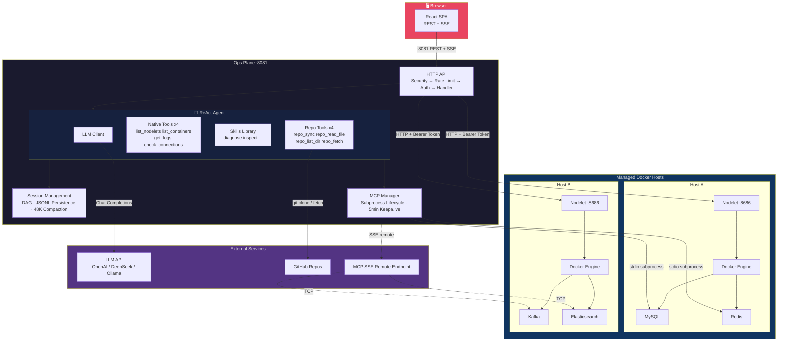

<p align="center">
  <h1>Oops — Ops Plane</h1>
  <em>All your servers, one pane of glass</em>
</p>

[中文](README.md) | English

[](https://go.dev/)
[](https://react.dev/)
[](LICENSE)

**Oops** is an AI-powered operations panel for multi-server environments, organized around projects. It gives you one interface for container status, logs, and health checks across nodes, plus a built-in ReAct Agent that can call native tools and MCP extensions to inspect context, run diagnostics, and handle common operations.

> Oops!... I Did It Again

---

## Architecture



- **Ops Plane** — Central service for the React frontend, REST API, and ReAct Agent. It turns user requests into Nodelet queries, native tool calls, and MCP tool calls, while managing MCP connection lifecycle and keepalive.

- **Nodelet** — Lightweight per-host agent exposing container lists, inspection, and log streaming over HTTP. A single host can run multiple containers; container boundaries are the sandbox boundary, and commands execute directly inside containers. A pairing token is generated on first run.

- **MCP Server** — Supports **stdio** as a local subprocess beside Ops Plane and **SSE** as a remote process. It connects to MySQL, Redis, ES, and other services, then exposes their operational capabilities as LLM-callable tools.

---

## Features

### 🐳 Docker & Container Management

- **Auto-detect 22 service types** from container image names: MySQL, Redis, PostgreSQL, MongoDB, Nginx, Elasticsearch, Kafka, Etcd, Jaeger, Nacos, RabbitMQ, ClickHouse, MinIO, Consul, ZooKeeper, Prometheus, Grafana, InfluxDB, Memcached, Cassandra, Neo4j, Caddy.
- **Container inspection**: view environment variables, port mappings, health status, and creation time.
- **Real-time log streaming** via SSE with ANSI color rendering.
- **Auto-detect Data Source Names** from container environment variables, with manual override support.
- **On-demand HTTP health checks** with immediate endpoint probe results.

### 🛡️ Sandboxed Command Execution

- **Container as sandbox**: the nodelet runs inside a Docker container, and the container boundary is the security boundary. Commands execute directly via `os/exec`.
- **Timeout control**: callers set deadlines via `context.Context`; expired processes are terminated automatically.
- **Output truncation**: tail 2000 lines / 50KB by default to control memory use.
- **Structured result**: stdout, stderr, exit code, duration, and truncation flag returned as a single struct.
- **Environment isolation**: custom working directory and environment variables, separated from the nodelet process.

### 🤖 AI Operations Assistant

- **Natural language troubleshooting**: "Why is Redis slow?" / "What errors are in the MySQL container?"
- **ReAct Agent** via the CloudWeGo Eino framework, with a reasoning-acting loop capped at 15 steps.
- **Skills system**: the LLM autonomously decides when to load diagnostic, inspection, or custom skills.
- **Streaming responses**: see agent reasoning steps, tool calls, and results in real time.
- **4 native tools**: `list_nodelets`, `list_containers`, `get_logs`, `check_connections`.

### 🧠 Context Engineering (v2)

- **DAG-based session entries** (message + compaction nodes) with branching support.
- **Automatic compaction**: when context exceeds ~48K tokens, earlier messages are summarized.
- **JSONL persistence** at `data/sessions/` — sessions survive server restarts.
- **64K input + 8K output** token budget with 2000-char tool result truncation.

### 🔌 MCP (Model Context Protocol) Integration

- **Dual transport**: stdio (local subprocess) and SSE (remote).
- **Pre-built MCP server binaries** for MySQL, Redis, Elasticsearch, Kafka, Etcd, Nacos.
- **Smart pre-fill**: auto-detects server IP, container port, and type defaults for connection forms.
- **Per-tool enable/disable** in the web UI.
- **In-UI tool connectivity testing**.
- **Auto-keepalive** every 5 minutes with automatic restart after failures.

### 📁 Project-Based Multi-Tenancy

- Create projects and assign nodelets to projects.
- Project-scoped chat sessions and container views.
- Global and per-project navigation modes.

### 🏥 Connection Monitoring

- Configure external service connections: Elasticsearch, Jaeger, Nacos, HTTP, TCP.
- Parallel health checks with independent per-connection timeouts.
- Dashboard real-time status indicators: alive / dead / unknown.

### 🔐 Authentication & Security

- **Single-user model**: interactive first-run setup, YAML persistence with bcrypt password hashing.
- JWT session tokens via HttpOnly cookies, key derived from password hash.
- Login rate limiting to reduce brute-force risk.
- Nodelet-to-server Bearer Token auth, auto-generated on first run.
- Per-nodelet API rate limiting: 50 req/s.

### 📊 Observability

- **Centralized console log viewer** with SSE push to browser.
- **Structured logging** via zap with lumberjack log rotation.
- **MCP subprocess stderr** capture and display.
- **Full-chain observability**: auth failures, rate-limit triggers, CRUD operations.

---

## Quick Start

### Prerequisites

- Go 1.25+
- Node.js 20+ (for building the frontend)
- Docker (for container management; nodelet deploys on Docker hosts)
- OpenAI-compatible API Key (for the AI assistant; supports DeepSeek, OpenAI, or any compatible provider)

### 1. Clone & Build

```bash
git clone git@github.com:agermel/oops.git
cd oops

# Build frontend
cd web && npm install && npm run build && cd ..

# Build central server
go build -o oops ./cmd/oops

# Build nodelet (or use Docker image)
go build -o oops-nodelet ./cmd/oops-nodelet
```

### 2. Configure

```bash
# Copy example config
cp config/config.example.yaml config/config.yaml
```

On first startup, an interactive prompt creates the initial user and generates the password hash.

Nodelets are added via the "Server Management" panel in the Web UI.

### 3. Start Nodelet

On each Docker host:

```bash
# Direct run
./oops-nodelet

# Via Docker Compose
cd deployment && docker compose -f docker-compose.nodelet.yml up -d
```

The nodelet listens on `:8686` and auto-generates a pairing token on first run (stored at `/var/lib/oops/nodelet/token` by default).

### 4. Start Ops Plane

```bash
OOPS_LLM_API_KEY="sk-..." ./oops
```

Open `http://localhost:8081` in a browser and log in.

### 5. (Optional) Enable MCP

```bash
# Set allowed MCP commands
export OOPS_MCP_ALLOWED_COMMANDS="mysql-mcp-server,redis-mcp-server"
```

Build MCP server binaries:

```bash
cd mcp-servers/mysql && go build -o mysql-mcp-server . && cd ../..
cd mcp-servers/redis && go build -o redis-mcp-server . && cd ../..
cd mcp-servers/etcd   && go build -o etcd-mcp-server .   && cd ../..
```

Add connections in the MCP management panel in the web UI.

---

## Configuration Reference

### Environment Variables

| Variable | Default | Description |
|---|---|---|
| `OOPS_ADDR` | `:8081` | Central server listen address |
| `OOPS_CONFIG` | `config/config.yaml` | Config file path |
| `OOPS_LLM_API_KEY` | — | LLM API Key (supports `${OOPS_LLM_API_KEY}` syntax) |
| `OOPS_BEHIND_PROXY` | `false` | Enable HSTS behind reverse proxy |
| `OOPS_CORS_ORIGIN` | — | CORS allowed origin |
| `OOPS_MCP_ALLOWED_COMMANDS` | — | Comma-separated MCP command whitelist |
| `OOPS_RUNTIME_DB` | `data/runtime.db` | SQLite runtime store path |
| `OOPS_NODELET_ADDR` | `:8686` | Nodelet listen address |
| `OOPS_NODELET_PUBLIC_ADDRESS` | `http://localhost:8686` | Nodelet public address |
| `OOPS_NODELET_LOG_PATH` | `/var/log/oops/nodelet.log` | Nodelet log file path |
| `OOPS_NODELET_TOKEN_FILE` | `/var/lib/oops/nodelet/token` | Token persistence path |

### Configuration Files

| File | Purpose |
|---|---|
| `config/config.yaml` | Main config: LLM, MCP defaults, external connections, data source DSNs |
| `config/skills/*.md` | Skill definitions (Markdown + YAML frontmatter) |
| `data/runtime.db` | SQLite runtime store for users, nodelets, MCP connections, projects, and container DSN overrides |
| `data/events.db` | SQLite event store (LLM conversation events) |
| `data/sessions/` | JSONL session files |

### Config Keys Reference

| Key | Description |
|---|---|
| `env` | Runtime environment: `"prod"` or `"dev"` |
| `connections` | External health check targets |
| `mysql` / `redis` / `etcd` / `kafka` | Data source DSNs |
| `otel` | OpenTelemetry endpoint |
| `llm` | LLM config (`enabled`, `model`, `base_url`, `api_key`) |
| `mcp` | MCP defaults (`enabled`, `transport`, `command` / `url`) |

See `config/config.example.yaml` for a complete example.

---

## API Overview

All authenticated routes pass through: `securityHeaders → rateLimit → authMiddleware → requireAuth → limitBody → handler`.

### Auth

| Method | Path | Description |
|---|---|---|
| `POST` | `/api/token` | Create session token (login) |
| `DELETE` | `/api/token` | Revoke session token (logout) |
| `GET` | `/api/auth/me` | Get current user info |

### Nodelets

| Method | Path | Description |
|---|---|---|
| `GET` | `/api/nodelets` | List nodelet configs |
| `GET` | `/api/nodelets/status` | Get statuses with health info |
| `POST` | `/api/nodelets` | Add a nodelet |
| `PUT` | `/api/nodelets/{id}` | Update a nodelet |
| `DELETE` | `/api/nodelets/{id}` | Remove a nodelet |
| `POST` | `/api/nodelets/test` | Test connectivity |
| `POST` | `/api/nodelets/{id}/probe` | Force-probe one nodelet |
| `POST` | `/api/nodelets/probe-all` | Force-probe all nodelets |
| `GET` | `/api/nodelets/{nodeletID}/containers` | List containers |
| `GET` | `/api/nodelets/{nodeletID}/containers/{containerID}/logs` | Get container logs |
| `GET` | `/api/nodelets/{nodeletID}/containers/{containerID}/logs/stream` | Stream container logs (SSE) |

### Chat & Sessions

| Method | Path | Description |
|---|---|---|
| `POST` | `/api/chat` | Send chat message (global scope) |
| `GET` | `/api/sessions` | List sessions |
| `GET` | `/api/sessions/{id}` | Get session detail |
| `DELETE` | `/api/sessions/{id}` | Delete a session |

### MCP Connections

| Method | Path | Description |
|---|---|---|
| `GET` | `/api/mcp/connections` | List MCP connections (with runtime status) |
| `POST` | `/api/mcp/connections` | Add MCP connection |
| `PUT` | `/api/mcp/connections/{id}` | Update MCP connection |
| `DELETE` | `/api/mcp/connections/{id}` | Remove MCP connection |
| `POST` | `/api/mcp/connections/test` | Test MCP connection |
| `POST` | `/api/mcp/connections/{id}/tools/{toolName}/test` | Test a specific MCP tool |

### Tools & Skills

| Method | Path | Description |
|---|---|---|
| `GET` | `/api/tools` | List all tools (native + MCP) |
| `PUT` | `/api/tools/{name}` | Toggle tool enabled state |
| `GET` | `/api/skills` | List skills |
| `PUT` | `/api/skills/{name}` | Update a skill |
| `DELETE` | `/api/skills/{name}` | Delete a skill |

### Projects

| Method | Path | Description |
|---|---|---|
| `GET` | `/api/projects` | List projects |
| `POST` | `/api/projects` | Create project |
| `GET` | `/api/projects/{pid}` | Get project detail |
| `PUT` | `/api/projects/{pid}` | Update project |
| `DELETE` | `/api/projects/{pid}` | Delete project |
| `POST` | `/api/projects/{pid}/chat` | Project-scoped chat |
| `GET` | `/api/projects/{pid}/sessions` | List project sessions |
| `GET` | `/api/projects/{pid}/sessions/{id}` | Get project session |
| `DELETE` | `/api/projects/{pid}/sessions/{id}` | Delete project session |
| `GET` | `/api/projects/{pid}/servers` | List project servers |
| `POST` | `/api/projects/{pid}/servers` | Assign server to project |
| `DELETE` | `/api/projects/{pid}/servers/{sid}` | Remove server from project |
| `GET` | `/api/projects/{pid}/servers/{sid}/containers` | List project containers |
| `GET` | `/api/projects/{pid}/servers/{sid}/containers/{cid}` | Container detail |
| `GET` | `/api/projects/{pid}/servers/{sid}/containers/{cid}/logs/stream` | Container log stream |
| `POST` | `/api/projects/{pid}/servers/{sid}/containers/{cid}/check` | Health check |
| `GET` | `/api/projects/{pid}/servers/{sid}/containers/{cid}/mcp` | Container MCP info |
| `DELETE` | `/api/projects/{pid}/servers/{sid}/containers/{cid}/mcp` | Delete MCP binding |
| `GET` | `/api/projects/{pid}/servers/{sid}/containers/{cid}/dsn` | Container DSN info |
| `PUT` | `/api/projects/{pid}/servers/{sid}/containers/{cid}/dsn` | Set DSN override |
| `DELETE` | `/api/projects/{pid}/servers/{sid}/containers/{cid}/dsn` | Delete DSN override |

### Other

| Method | Path | Description |
|---|---|---|
| `GET` | `/api/connections/status` | Connection health status |
| `GET` | `/api/console/stream` | Console log SSE stream |

---

## Project Structure

```
oops/
├── cmd/
│   ├── oops/                  # Central server entry point
│   └── oops-nodelet/          # Nodelet agent entry point
├── internal/
│   ├── api/                   # HTTP REST API: routes, handlers, middleware
│   ├── auth/                  # JWT auth, bcrypt hashing, user store, rate limiting
│   ├── common/                # Shared utilities (env vars, etc.)
│   ├── config/                # Config loading (Viper), project store, DSN store
│   ├── connection/            # External health check framework + registry
│   ├── console/               # Centralized log console hub (SSE push to browser)
│   ├── docker/                # Docker client, 22 service type detector, DSN extraction
│   ├── exec/                  # Sandboxed command execution: timeout, truncation, structured output (nodelet side)
│   ├── llm/                   # LLM Agent (ReAct via Eino), tools, skills, sessions, context builder, retry
│   ├── logutil/               # Structured logging (zap + lumberjack rotation)
│   ├── mcp/                   # MCP manager, client, tool registry, keepalive
│   ├── nodelet/               # Nodelet HTTP server, client, manager, prober
│   ├── store/                 # Generic JSON file persistence (atomic writes)
│   └── web/                   # Static file serving with auth wrapping
├── web/                       # React SPA (TypeScript, Vite, Lucide icons)
│   └── src/components/        # UI components (30+ components)
├── config/                    # Config files, skills, LLM prompts
├── deployment/                # Nodelet Dockerfile & docker-compose
├── mcp-servers/               # Pre-built MCP server binaries & source
│   ├── mysql/                 # MySQL MCP Server
│   ├── redis/                 # Redis MCP Server
│   ├── elasticsearch/         # Elasticsearch MCP Server
│   ├── kafka/                 # Kafka MCP Server
│   ├── etcd/                  # Etcd MCP Server (8 tools)
│   └── nacos/                 # Nacos MCP Server
└── data/                      # Runtime data: SQLite, YAML users, JSONL sessions
```

---

## Development Guide

### Backend

```bash
# Run central server in dev mode
go run ./cmd/oops

# Run local nodelet for development
go run ./cmd/oops-nodelet

# Run all tests
go test ./...

# Run specific package tests
go test ./internal/llm/...
```

Core dependencies: CloudWeGo Eino (LLM Agent framework), Moby (Docker client), mcp-go (MCP protocol), zap (logging), Viper (config), modernc.org/sqlite (pure-Go SQLite).

### Frontend

```bash
cd web
npm install
npm run dev       # Dev server with HMR on :5173
npm run build     # Production build to web/dist/
```

Core dependencies: React 19, TypeScript, Vite 8, TanStack Query (server state), Lucide React (icons), ansi-to-html (log rendering), streamdown (Markdown streaming), @microsoft/fetch-event-source (SSE client).

### Adding a New Skill

Create a `.md` file under `config/skills/`. Skills are hot-loaded via fsnotify — no restart needed:

```markdown
---
name: my-skill
description: Short description of what this skill does
icon: Zap
label: My Skill
color: blue
---
Your skill instructions. This content is injected into the system prompt
when the LLM decides to load this skill.
```

### Adding a New MCP Server

1. Place the MCP server binary under `mcp-servers/<name>/`
2. Add a connection via the MCP management panel in the Web UI. Runtime configuration is stored in `data/runtime.db`
3. MCP connections support both `stdio` (local subprocess) and `sse` (remote) transports

---

## Tech Stack

| Layer | Technology |
|---|---|
| Language | Go 1.25 |
| LLM Agent Framework | [CloudWeGo Eino](https://github.com/cloudwego/eino) (ReAct Agent) |
| MCP Protocol | [mcp-go](https://github.com/mark3labs/mcp-go) |
| Docker Client | [Moby](https://github.com/moby/moby) |
| Logging | [zap](https://github.com/uber-go/zap) + [lumberjack](https://github.com/natefinch/lumberjack) |
| Config | [Viper](https://github.com/spf13/viper) |
| Database | SQLite (pure-Go: [modernc.org/sqlite](https://modernc.org/sqlite)) |
| Auth | JWT ([golang-jwt](https://github.com/golang-jwt/jwt)) + bcrypt |
| Frontend | React 19, TypeScript, Vite 8, [TanStack Query](https://tanstack.com/query) |
| Icons | [Lucide React](https://lucide.dev/) |
| Container Exec | `internal/exec` — Container-as-sandbox, os/exec wrapper, timeout + output truncation |
| AI Provider | OpenAI-compatible API (DeepSeek, OpenAI, or any compatible provider) |
| Container Runtime | Docker Engine API |

---

## FAQ

**Q: Nodelet shows as unavailable in the panel?**
Check the nodelet process, port 8686 connectivity, and token configuration. The token in the Web UI must match the token generated by the nodelet on first run, stored at `/var/lib/oops/nodelet/token` by default or at `OOPS_NODELET_TOKEN_FILE` when configured.

**Q: AI assistant says "LLM not enabled" or does not respond?**
Set the `OOPS_LLM_API_KEY` environment variable and ensure `llm.enabled: true` in `config/config.yaml`. Verify `base_url` matches your API provider.

**Q: MCP tools do not appear in the tool list?**
Ensure `mcp.enabled: true`, the MCP server binary path is correct and executable. Use the "Test" button in the MCP panel to verify connectivity, and check console logs for stderr output.

**Q: Can I use a local LLM like Ollama?**
Yes. Set `llm.base_url` to your Ollama endpoint (e.g. `http://localhost:11434/v1`) and `llm.model` to your local model name. Any OpenAI-compatible API works.

**Q: Session history lost after restart?**
Sessions persist to `data/sessions/` as JSONL files. Ensure the directory exists and is writable by the oops process.

**Q: How to change the compaction threshold?**
The default threshold is 48K tokens in `DefaultCompactionConfig()` (`internal/llm/context_builder.go`). Future releases will make this configurable via `config.yaml`.

**Q: How to change the user password?**
Clear the `users` table in `data/runtime.db`, restart Oops Plane, and the interactive first-run flow will prompt for new credentials. The current release supports a single-user model.

**Q: Nodelet Docker container won't start?**
Ensure `/var/log/oops` and `/var/lib/oops` exist on the host with proper permissions. The Docker Compose file is at `deployment/docker-compose.nodelet.yml`.

---

## License

MIT — See [LICENSE](LICENSE) for details.

---

**Oops** — *Infrastructure, no surprises.*
