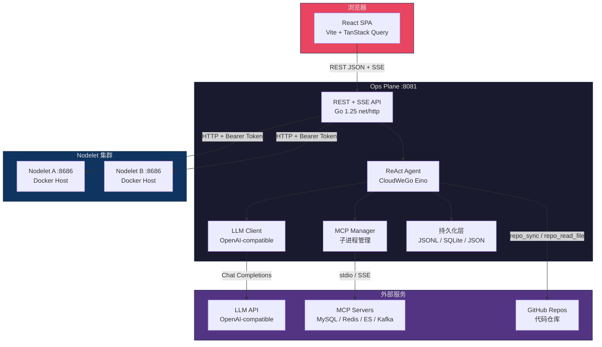
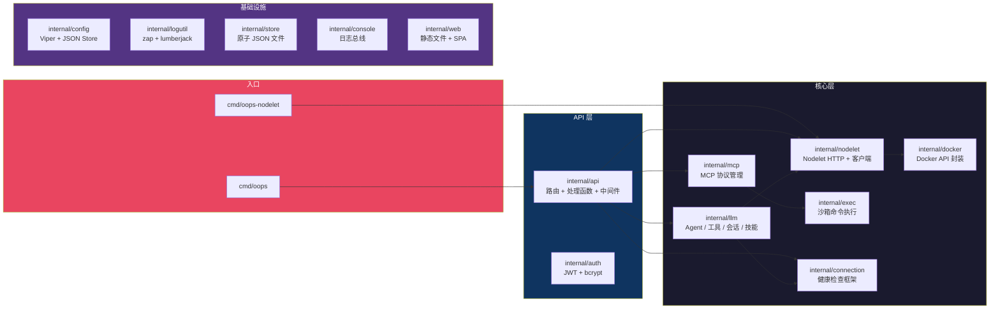
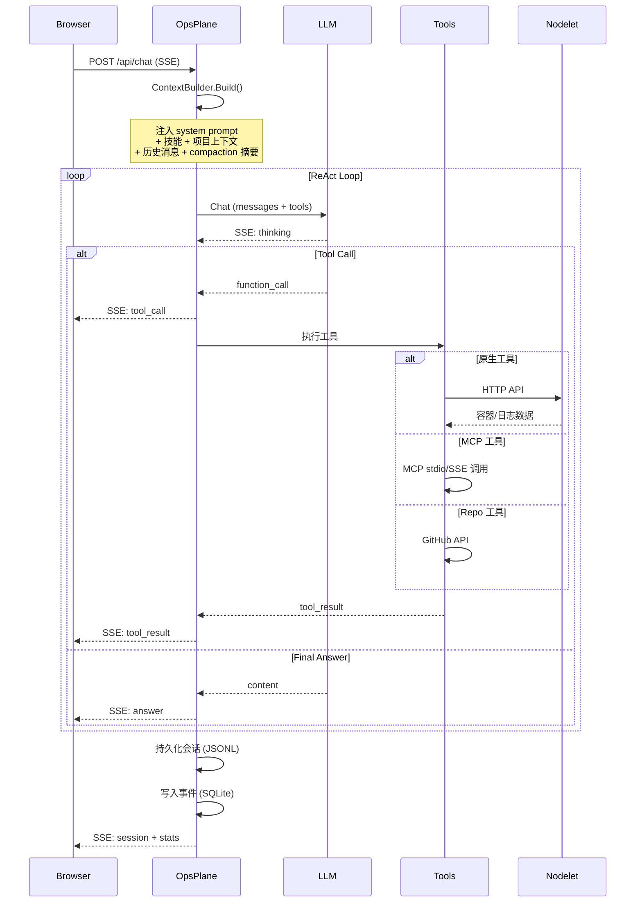
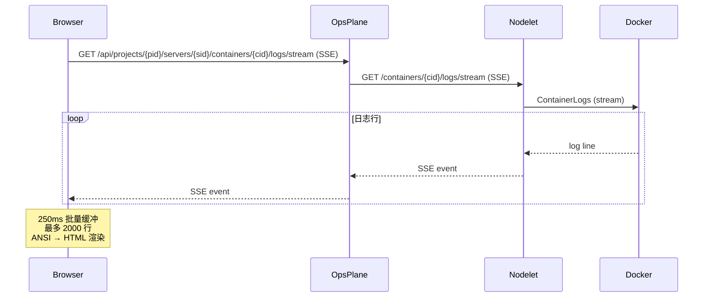
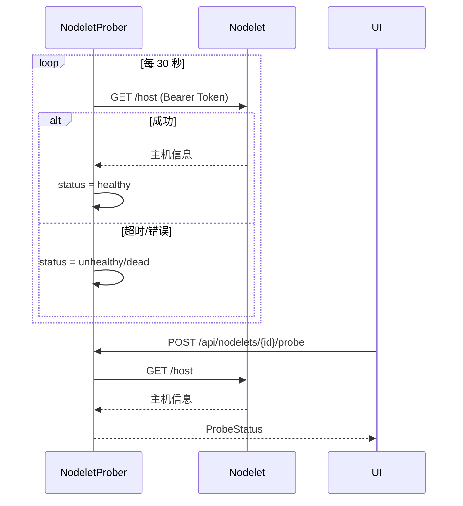
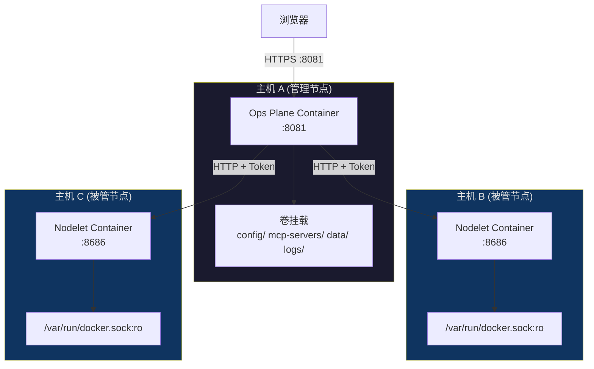

# Oops (Ops Plane) 架构文档

## 1. 项目概述

**Oops** 是一个 AI 驱动的运维面板，将多台 Docker 主机整合到统一界面中，提供容器管理、日志流、健康检查和自然语言运维问答能力。

核心能力：
- **多主机统一管理**：通过 Nodelet 代理聚合多台 Docker 主机的容器状态
- **ReAct Agent 对话**：自然语言提问，Agent 自动调用工具链完成运维任务
- **MCP 协议扩展**：通过 Model Context Protocol 接入 MySQL、Redis、ES、Kafka 等外部数据源
- **健康检查框架**：可扩展的连接健康检查，支持 HTTP、TCP、Elasticsearch 等
- **实时日志流**：基于 SSE 的容器日志实时推送

## 2. 系统架构总览



## 3. 组件详解

### 3.1 Ops Plane (中心服务)

入口：[cmd/oops/main.go](../cmd/oops/main.go)，监听 `:8081`。

```
cmd/oops/main.go
├── logutil.Init()          → 结构化日志 (zap + lumberjack)
├── config.LoadRuntime()    → Viper 配置加载
├── api.NewFromConfig()     → 组装全部依赖
│   ├── nodelet.Manager     → Nodelet 配置管理
│   ├── nodelet.Prober      → 后台健康探活 (30s)
│   ├── mcp.Manager         → MCP 子进程生命周期
│   ├── llm.Client          → LLM 客户端
│   ├── llm.SkillStore      → 技能热加载
│   ├── llm.ContextBuilder  → 上下文工程
│   ├── llm.SessionStore    → 会话持久化
│   ├── llm.EventStore      → 事件审计 (SQLite)
│   ├── auth.Store          → 用户认证
│   └── config.ProjectStore → 项目持久化
└── api.Server.Mount()      → 注册 80+ REST 路由
```

**中间件链**：`securityHeaders → rateLimit → authMiddleware → requireAuth → limitBody → handler`

### 3.2 Nodelet (主机代理)

入口：[cmd/oops-nodelet/main.go](../cmd/oops-nodelet/main.go)，监听 `:8686`。

```
cmd/oops-nodelet/main.go
├── resolveToken()          → 自动生成 Bearer Token (32B hex)
├── docker.NewClient()      → Docker Engine API 客户端
└── nodelet.Server          → HTTP API
    ├── GET  /host          → 主机信息
    ├── GET  /containers    → 容器列表
    ├── GET  /containers/:id/inspect → 容器详情
    ├── GET  /containers/:id/logs    → 历史日志
    └── GET  /containers/:id/logs/stream → 日志 SSE 流
```

安全机制：Token 恒定时间比较、速率限制 (50 req/s)、只读 Docker 套接字。

### 3.3 MCP 服务器

位于 [mcp-servers/](../mcp-servers/)，预置 6 种数据源连接器：

| 服务器 | 传输方式 | 用途 |
|--------|---------|------|
| MySQL | stdio | 数据库查询 |
| Redis | stdio | 缓存/队列操作 |
| Elasticsearch | stdio | 日志搜索 |
| Kafka | stdio | 消息队列 |
| Etcd | stdio | 配置中心 |
| Nacos | stdio | 服务发现 |

支持两种连接模式：
- **stdio**：Ops Plane 启动子进程，通过标准输入输出通信
- **SSE**：连接远程 MCP 端点，通过 HTTP SSE 通信

## 4. 后端包结构



### 4.1 关键包职责

| 包 | 文件 | 职责 |
|---|------|------|
| `internal/api` | `server.go` | 路由挂载、依赖组装、中间件链 |
| | `chat_handlers.go` | 对话 SSE 流处理 |
| | `llm_ops.go` | LLM 运维接口 (工具数据源) |
| `internal/llm` | `agent.go` | ReAct Agent (CloudWeGo Eino) |
| | `client.go` | OpenAI 兼容 LLM 客户端 |
| | `tools.go` | 原生工具定义 (4 个) |
| | `tools_repo.go` | 代码仓库工具 (4 个) |
| | `context_builder.go` | 上下文构建 + 自动压缩 |
| | `session.go` | 会话 DAG 结构 + JSONL 持久化 |
| | `skills.go` | 技能管理 + fsnotify 热加载 |
| `internal/mcp` | `manager.go` | MCP 子进程生命周期 + 工具注册 |
| | `client.go` | stdio / SSE 双模 MCP 客户端 |
| `internal/nodelet` | `server.go` | Nodelet HTTP API |
| | `client.go` | Ops Plane → Nodelet HTTP 客户端 |
| | `manager.go` | Nodelet 配置 CRUD |
| | `prober.go` | 后台健康探活 |
| `internal/connection` | `registry.go` | 检查器注册表 |
| | `checker/` | HTTP / TCP / ES 健康检查器 |
| `internal/docker` | `client.go` | Docker Engine API 封装 |
| | `detector.go` | 22 种服务类型自动检测 |
| `internal/exec` | `exec.go` | 沙箱命令执行 (超时/截断) |
| `internal/config` | `config.go` | Viper 配置加载 |
| | `projects.go` | 项目 JSON Store |
| `internal/store` | `store.go` | 原子 JSON 文件读写 |

## 5. 前端架构

```
web/src/
├── main.tsx              → React 根挂载
├── App.tsx               → 根组件 (路由 + 状态)
├── types.ts              → TypeScript 类型定义
├── styles/               → CSS 样式
│   ├── base.css, layout.css, chat.css
│   ├── console.css, login.css, projects.css
│   └── shared.css, responsive.css
├── components/
│   ├── ChatView.tsx      → 对话界面
│   ├── ConsolePanel.tsx  → 控制台日志
│   ├── ServerTree.tsx    → 服务器树
│   ├── ContainerDetail.tsx → 容器详情
│   ├── ContainerLogs.tsx → 容器日志
│   ├── ContainerHealth.tsx → 健康检查
│   ├── MCPView.tsx       → MCP 连接管理
│   ├── MCPFormModal.tsx  → MCP 连接表单
│   ├── ProjectsView.tsx  → 项目列表
│   ├── ProjectDetailView.tsx → 项目详情
│   ├── SkillsView.tsx    → 技能管理
│   ├── ToolsView.tsx     → 工具管理
│   ├── NodeletManagementView.tsx → Nodelet 管理
│   ├── LoginPage.tsx     → 登录页
│   └── ui/               → UI 原子组件
├── hooks/
│   ├── useProjects.ts    → TanStack Query hooks
│   ├── usePathRouter.ts  → Hash 路由
│   └── useTypewriter.ts  → 打字机动画
└── lib/
    ├── api.ts            → fetch 封装
    ├── config.ts         → 页面配置读取
    └── paths.ts          → API URL 构建
```

技术栈：React 19 + TypeScript 5.6 + Vite 8 + TanStack Query 5

## 6. 核心数据流

### 6.1 ReAct Agent 对话流



### 6.2 容器日志流



### 6.3 Nodelet 健康探活



## 7. API 设计

### 7.1 路由总览

```
/auth
  POST   /api/token                    → 登录
  DELETE /api/token                    → 登出
  GET    /api/auth/me                  → 当前用户

/connections
  GET    /api/connections/status       → 健康检查状态

/nodelets
  GET    /api/nodelets                 → Nodelet 列表
  GET    /api/nodelets/status          → 探活状态
  POST   /api/nodelets                 → 添加 Nodelet
  PUT    /api/nodelets/{id}            → 更新 Nodelet
  DELETE /api/nodelets/{id}            → 删除 Nodelet
  POST   /api/nodelets/test            → 测试连接
  POST   /api/nodelets/{id}/probe      → 单次探活
  POST   /api/nodelets/probe-all       → 全部探活
  GET    /api/nodelets/{id}/containers → 容器列表
  GET    /api/nodelets/{id}/containers/{id}/logs        → 历史日志
  GET    /api/nodelets/{id}/containers/{id}/logs/stream → 日志流

/chat
  POST   /api/chat                     → 全局对话
  GET    /api/sessions                 → 会话列表
  GET    /api/sessions/{id}            → 会话详情
  DELETE /api/sessions/{id}            → 删除会话

/mcp
  GET    /api/mcp/connections          → MCP 连接列表
  POST   /api/mcp/connections          → 添加 MCP 连接
  PUT    /api/mcp/connections/{id}     → 更新 MCP 连接
  DELETE /api/mcp/connections/{id}     → 删除 MCP 连接
  POST   /api/mcp/connections/{id}/test        → 测试连接
  POST   /api/mcp/connections/{id}/tools/{name}/test → 测试工具
  POST   /api/mcp/connections/test     → 测试表单连接

/tools
  GET    /api/tools                    → 工具列表
  PUT    /api/tools/{name}             → 启用/禁用工具

/skills
  GET    /api/skills                   → 技能列表
  PUT    /api/skills/{name}            → 更新技能
  DELETE /api/skills/{name}            → 删除技能

/console
  GET    /api/console/stream           → 控制台 SSE 流

/projects
  GET    /api/projects                 → 项目列表
  POST   /api/projects                 → 创建项目
  GET    /api/projects/{pid}           → 项目详情
  PUT    /api/projects/{pid}           → 更新项目
  DELETE /api/projects/{pid}           → 删除项目

/projects/{pid}
  POST   /chat                         → 项目对话
  GET    /sessions                     → 项目会话列表
  GET    /sessions/{id}                → 项目会话详情
  DELETE /sessions/{id}                → 删除项目会话
  GET    /servers                      → 项目服务器列表
  POST   /servers                      → 添加服务器
  DELETE /servers/{sid}                → 移除服务器

/projects/{pid}/servers/{sid}
  GET    /containers                   → 容器列表
  GET    /containers/{cid}             → 容器详情
  GET    /containers/{cid}/logs/stream → 容器日志流
  POST   /containers/{cid}/check       → 健康检查
  GET    /containers/{cid}/mcp         → MCP 绑定信息
  DELETE /containers/{cid}/mcp         → 解除 MCP 绑定
  GET    /containers/{cid}/dsn         → DSN 覆盖值
  PUT    /containers/{cid}/dsn         → 设置 DSN 覆盖值
  DELETE /containers/{cid}/dsn         → 删除 DSN 覆盖值
```

### 7.2 中间件栈

```
Request
  → securityHeaders    (CSP / X-Frame-Options / HSTS)
  → rateLimit          (令牌桶, /api/chat 独立限制)
  → authMiddleware     (JWT Cookie 解析, 公共端点放行)
  → requireAuth        (403 若未认证)
  → limitBody          (请求体大小限制)
  → Handler
```

### 7.3 SSE 事件类型

对话流 (`/api/chat`) 使用以下事件：

| 事件类型 | 方向 | 含义 |
|---------|------|------|
| `thinking` | → | Agent 正在推理 |
| `tool_call` | → | Agent 决定调用工具 |
| `tool_result` | → | 工具返回结果 |
| `answer` | → | 最终回答 |
| `error` | → | 错误信息 |
| `session` | → | 会话元数据 |
| `stats` | → | 统计信息 (token 数等) |

## 8. 数据模型

### 8.1 持久化文件

```
data/
├── sessions/
│   └── sess_<uuid>.jsonl     → 会话消息 (每行一个 JSON)
├── events.db                 → SQLite 事件审计
└── users.yml                 → 用户密码 (bcrypt)

config/
├── config.yaml               → 应用配置 (Viper)
├── skills/                   → 技能 Markdown 文件
│   ├── default.md
│   ├── diagnose.md
│   └── inspect.md
├── nodelets.json             → Nodelet 配置
├── mcp_connections.json      → MCP 连接配置
├── projects.json             → 项目配置
└── container_dsn.json        → 容器 DSN 覆盖值
```

### 8.2 会话 DAG 结构

```
Session
├── ID, ProjectID
├── Messages (有序)
│   ├── user    → 用户问题
│   ├── ai      → Agent 回答 (+ tool_calls 数组)
│   └── tool    → 工具返回
├── Entries (压缩)
│   ├── CompactionEntry → 历史摘要
│   └── SummaryEntry    → 阶段性摘要
└── Metadata
    ├── TokenCount
    └── CreatedAt / UpdatedAt
```

### 8.3 项目层级

```
Project
├── ID, Name, Description
├── GitHubRepo (可选, Agent 代码上下文)
└── Servers[]
    └── Server
        ├── ID
        ├── NodeletID  → 关联 Nodelet
        └── Containers[]
            ├── ContainerID
            ├── ServiceType (自动检测: mysql/redis/es/kafka/...)
            ├── DSN (可覆盖)
            └── MCPConnectionID (可绑定)
```

## 9. Agent 工具体系

### 9.1 工具分类

```
工具总数: 8+ (4 原生 + 4 仓库 + MCP 动态)
```

| 类别 | 工具名 | 功能 |
|------|--------|------|
| **原生** | `list_nodelets` | 列出所有受监控主机 |
| | `list_containers` | 列出指定主机容器 |
| | `get_logs` | 获取容器历史日志 |
| | `check_connections` | 执行连接健康检查 |
| **仓库** | `repo_sync` | 同步 GitHub 仓库到本地 |
| | `repo_list_dir` | 列出仓库目录结构 |
| | `repo_read_file` | 读取仓库文件内容 |
| | `repo_fetch` | 获取仓库最新提交 |
| **技能** | `skill` | 注入预定义运维技能 |
| **MCP** | 动态注册 | 来自 MCP 连接的工具 (SQL 查询, Redis 操作等) |

### 9.2 ReAct 循环

```
用户问题 → ContextBuilder (注入 system prompt + 技能 + 项目上下文)
  → LLM 思考
    → 需要工具? → 执行工具 → 观察结果 → 继续思考
    → 不需要? → 输出最终答案
  → 持久化会话
```

## 10. 部署架构



### 10.1 Docker Compose

```yaml
# deployment/docker-compose.yml
services:
  oops:        # Ops Plane 中心服务
    build: deployment/Dockerfile (多阶段: node + go → alpine)
    ports: "8081:8081"
    volumes: config/, mcp-servers/, data/, logs/

  nodelet:     # 本地 Nodelet (可选)
    build: deployment/Dockerfile.nodelet
    ports: "8686:8686"
    volumes: /var/run/docker.sock:ro, nodelet-data/, nodelet-logs/
```

### 10.2 环境变量

| 变量 | 默认值 | 用途 |
|------|--------|------|
| `OOPS_ADDR` | `:8081` | Ops Plane 监听地址 |
| `OOPS_CONFIG` | `config/config.yaml` | 配置文件路径 |
| `OOPS_LLM_ENABLED` | `true` | 启用 LLM |
| `OOPS_LLM_BASE_URL` | - | LLM API 地址 |
| `OOPS_LLM_API_KEY` | - | LLM API 密钥 |
| `OOPS_LLM_MODEL` | - | 模型名称 |
| `OOPS_MCP_ALLOWED_COMMANDS` | (全部允许) | MCP 命令白名单 |
| `OOPS_NODELET_ADDR` | `:8686` | Nodelet 监听地址 |
| `OOPS_NODELET_PUBLIC_ADDRESS` | `http://localhost:8686` | Nodelet 公网地址 |
| `OOPS_NODELET_TOKEN_FILE` | `/var/lib/oops/nodelet/token` | Token 文件路径 |
| `OOPS_NODELET_LOG_PATH` | `/var/log/oops/nodelet.log` | Nodelet 日志路径 |

## 11. 安全模型

```
┌─────────────────────────────────────────────┐
│                  Browser                     │
│  JWT Cookie (HttpOnly, Secure, SameSite)    │
└──────────────────┬──────────────────────────┘
                   │ HTTPS
┌──────────────────▼──────────────────────────┐
│               Ops Plane                      │
│  ┌──────────────────────────────────────┐   │
│  │ authMiddleware → JWT 验证             │   │
│  │ rateLimit → 令牌桶限流               │   │
│  │ securityHeaders → CSP / HSTS / XFO   │   │
│  └──────────────────────────────────────┘   │
│                                              │
│  MCP: OOPS_MCP_ALLOWED_COMMANDS 白名单      │
└──────────────────┬──────────────────────────┘
                   │ HTTP + Bearer Token
┌──────────────────▼──────────────────────────┐
│               Nodelet                         │
│  ┌──────────────────────────────────────┐   │
│  │ TokenAuth → 恒定时间比较              │   │
│  │ rateLimit → 50 req/s                 │   │
│  └──────────────────────────────────────┘   │
│  Docker Socket: read-only                   │
└─────────────────────────────────────────────┘
```

## 12. 技术选型

| 层次 | 技术 | 选型理由 |
|------|------|---------|
| **后端语言** | Go 1.25 | 高性能、单二进制部署、丰富生态 |
| **HTTP 路由** | Go 1.22+ `net/http` | 原生方法+路径参数，零依赖 |
| **Agent 框架** | CloudWeGo Eino | ReAct Agent 实现，OpenAI 兼容 |
| **MCP 协议** | mark3labs/mcp-go | Go 原生 MCP 实现 |
| **Docker API** | moby/moby | Docker Engine API 标准客户端 |
| **日志** | zap + lumberjack | 高性能结构化日志 + 自动轮转 |
| **配置** | Viper | YAML + 环境变量展开 |
| **前端框架** | React 19 | 成熟生态，丰富组件 |
| **状态管理** | TanStack Query | 服务端状态，自动缓存/失效 |
| **构建工具** | Vite 8 | 极速 HMR，ESM 原生 |
| **会话存储** | JSONL 文件 | 人类可读，重启可恢复，DAG 友好 |
| **事件审计** | SQLite | 嵌入式，零运维 |
